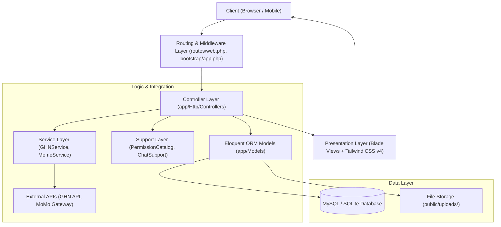

# 🏛️ Architecture & Data Architecture Specification

> **Tài liệu tham chiếu chuyên sâu về kiến trúc hệ thống, cơ sở dữ liệu và các cổng tích hợp của LensStore.**

---

## 1. Mô Hình Kiến Trúc Phân Tầng (Layered Architecture)

Dự án tuân theo mô hình phân tầng chuẩn mực của Laravel hiện đại, phân tách rõ ràng trách nhiệm giữa các lớp:

### Chi tiết các tầng:
1. **Presentation Layer (Tầng Giao Diện)**:
   - Sử dụng Laravel Blade Engine chia làm 3 Layout chính:
     - `layouts/app.blade.php`: Giao diện khách hàng (Glassmorphism, Navbar trong suốt, Chat Widget nhúng, Footer).
     - `layouts/admin.blade.php`: Giao diện quản trị Admin (Sidebar cố định 272px, Dark/Light surface contrast, Chart.js).
     - `layouts/auth.blade.php`: Giao diện đăng nhập/đăng ký chia 2 cột với panel hiệu ứng hình ảnh.
   - Styling: Tailwind CSS v4 (`@import 'tailwindcss';`) kết hợp hệ thống biến CSS đồng bộ (`--primary`, `--surface`, `--text-main`, v.v.).
   - Client logic: Vanilla JavaScript điều khiển AJAX gọi API (Giỏ hàng, Chọn sản phẩm, Chat realtime polling, nạp địa giới GHN).

2. **Routing & Security Middleware Layer**:
   - Khai báo tại `routes/web.php` và đăng ký middleware tại `bootstrap/app.php`.
   - Middleware `role` và `permission` từ package Spatie (`\Spatie\Permission\Middleware\...`).
   - Ngoại lệ CSRF: `validateCsrfTokens(except: ['/payment/momo/ipn'])` cho phép server MoMo gửi Webhook IPN mà không bị chặn token.

3. **Controller Layer (Tầng Điều Hướng)**:
   - Nguyên tắc: **Thin Controller** — Chỉ đóng vai trò nhận request, xác thực dữ liệu qua `$request->validate()`, điều phối Service/Model, và trả về View hoặc JSON Response.
   - Chia namespace: `App\Http\Controllers` (Storefront chung), `App\Http\Controllers\Admin` (Quản trị), `App\Http\Controllers\User` (Khách hàng), `App\Http\Controllers\Api` (Tiện ích AJAX).

4. **Service & Support Layer**:
   - `GHNService`: Xử lý giao tiếp với máy chủ Giao Hàng Nhanh v2, parse response, xử lý timeout và fallback phí ship 30.000đ khi mạng chập chờn.
   - `MomoService`: Sinh chữ ký điện tử HMAC-SHA256, tạo giao dịch `captureWallet`, xác thực callback chữ ký từ MoMo.
   - `PermissionCatalog`: Định nghĩa danh mục quyền và nhóm quyền hiển thị trên UI.
   - `ChatSupport`: Chuẩn hóa câu query tin nhắn và đóng gói payload JSON cho widget chat.

5. **Data Access & Eloquent ORM**:
   - Sử dụng các Model độc lập, liên kết quan hệ chặt chẽ (`belongsTo`, `hasMany`, `morphTo`).
   - Cơ chế bảo vệ tồn kho và biến động lịch sử kho thông qua `InventoryTransaction`.

---

## 2. Hệ Thống Cơ Sở Dữ Liệu (42 Migrations & Database Schema)

Hệ thống database được tổ chức thành 6 phân hệ nghiệp vụ chính:

### 2.1. Phân hệ Người Dùng & Định Danh (User & Identity)
- **`users`**:
  - `id`, `name`, `email`, `password`, `role` (`admin`, `staff`, `customer`).
  - `phone`, `cccd`, `birthday`, `gender`, `address`, `avatar`.
  - `verification_code`, `verification_code_expires_at`, `email_verified_at`: Quản lý OTP kích hoạt email.
  - `is_active`: Trạng thái tài khoản (1: hoạt động, 0: bị khóa bởi admin).
- **`user_addresses`**: Sổ địa chỉ giao hàng của người dùng (`province_id`, `district_id`, `ward_code`, `address_detail`, `is_default`).
- **`customer_notes`**: Ghi chú CRM của nhân viên tư vấn dành riêng cho từng khách hàng (`customer_id`, `user_id`, `content`).

### 2.2. Phân hệ Phân Quyền RBAC (Spatie Permissions)
- Tạo bởi migration `2026_09_17_022549_create_permission_tables.php`:
  - `roles`: Bảng các vai trò chức vụ (Admin, Quản lý kho, Nhân viên kinh doanh, v.v.).
  - `permissions`: Bảng các quyền hạn hạt nhân (`view_dashboard`, `manage_orders`, `manage_products`, `manage_goods_receipts`, v.v.).
  - `model_has_roles`, `model_has_permissions`, `role_has_permissions`: Bảng liên kết trung gian.

### 2.3. Phân hệ Danh Mục & Sản Phẩm Quang Học (Catalog & Optical Products)
- **`categories`**: `id`, `name`, `description`.
- **`products`**:
  - Nhận diện: `id`, `category_id`, `name`, `sku`, `brand`, `brand_description`.
  - Thông số kỹ thuật chuyên dụng ống kính: `focal_length` (tiêu cự), `aperture` (khẩu độ lớn nhất), `mount` (ngàm ống kính: E-mount, RF-mount, Z-mount...).
  - Giá cả & Trạng thái: `price` (decimal 12,2), `status` (`in_stock`, `out_of_stock`).
  - **Quản lý Tồn Kho Đa Tầng (Multi-tier Stock)**:
    - `stock`: Số lượng tồn kho sẵn sàng bán (Available to sell).
    - `reserved_stock`: Số lượng đang được giữ chỗ trong các đơn hàng chưa giao xong.
    - `defective_stock`: Số lượng hàng lỗi/hỏng chờ bảo hành hoặc thanh lý (chuyển từ QC).
  - Hình ảnh: `image` (ảnh đại diện), `gallery_images` (JSON mảng ảnh chi tiết), `sample_images` (JSON mảng ảnh chụp mẫu thực tế từ ống kính).

### 2.4. Phân hệ Bán Hàng & Đơn Hàng (Commerce & Orders)
- **`carts`**: `id`, `user_id`, `product_id`, `quantity`, `is_selected` (boolean phục vụ chọn sản phẩm thanh toán).
- **`vouchers`**:
  - `code`, `discount_type` (`fixed`, `percent`), `discount_value`.
  - `min_order_value`, `max_discount_value`, `starts_at`, `expires_at`, `usage_limit`, `used_count`, `is_active`.
- **`orders`**:
  - Định danh: `id`, `order_code` (Mã định dạng chuẩn: `LSyymmddXXXX`), `user_id`.
  - Thông tin người nhận: `recipient_name`, `recipient_phone`, `province_id`, `province_name`, `district_id`, `district_name`, `ward_code`, `ward_name`, `address_detail`.
  - Tài chính: `subtotal`, `shipping_fee`, `voucher_code`, `discount_amount`, `total`.
  - Phương thức thanh toán: `payment_method` (`cod`, `bank_transfer`, `momo`).
  - Trạng thái thanh toán: `payment_status` (`unpaid`, `paid`, `refunded`).
  - Vận đơn: `ghn_order_code` (Mã vận đơn do GHN trả về).
  - Trạng thái vòng đời đơn: `status`:
    - `pending` (Chờ xác nhận)
    - `preparing` (Đang chuẩn bị hàng)
    - `picked_up` (ĐVVC đã lấy hàng)
    - `delivering` (Đang giao hàng)
    - `completed` (Giao hàng thành công)
    - `finished` (Đã hoàn thành - tự động sau 10 ngày hoặc khách xác nhận)
    - `returning` (Đang yêu cầu trả hàng / hoàn tiền)
    - `returned` (Đã hoàn tiền / trả hàng)
    - `cancelled` (Đã hủy)
- **`order_items`**: `id`, `order_id`, `product_id`, `product_name`, `quantity`, `unit_price`, `subtotal`.
- **`payment_transactions`**: Lưu vết chi tiết giao dịch cổng thanh toán (`order_id`, `gateway`, `gateway_order_id`, `transaction_id`, `amount`, `status`, `request_payload`, `response_payload`).

### 2.5. Phân hệ Quản Trị Kho Chuyên Sâu (Mini ERP / Warehouse)
- **`suppliers`**: `id`, `name`, `phone`, `email`, `address`, `tax_code`.
- **`goods_receipts`**: Phiếu nhập kho (`id`, `receipt_code`, `supplier_id`, `user_id`, `total_amount`, `note`, `status`: `draft`/`completed`).
- **`goods_receipt_details`**: Chi tiết phiếu nhập (`goods_receipt_id`, `product_id`, `quantity`, `unit_price`, `subtotal`).
- **`goods_issues`**: Phiếu xuất kho (`id`, `order_id`, `user_id`, `type`: `sale`/`damage`/`internal`, `status`: `draft`/`completed`, `note`).
- **`goods_issue_details`**: Chi tiết phiếu xuất (`goods_issue_id`, `product_id`, `quantity`).
- **`inventory_transactions`**: Bảng sổ cái biến động kho (`id`, `product_id`, `type`: `in`/`out`, `quantity`, `reference_type`, `reference_id`, `note`) sử dụng quan hệ Đa hình (Polymorphic).

### 2.6. Phân hệ Chăm Sóc Khách Hàng, Đổi Trả & Nội Dung
- **`messages`**: Tin nhắn chat (`id`, `sender_id`, `receiver_id`, `content`, `image_url`, `product_id`, `is_read`, `created_at`).
- **`reviews`**: Đánh giá sản phẩm (`user_id`, `product_id`, `order_id`, `rating`, `comment`, `is_visible`).
- **`return_requests`**: Yêu cầu trả hàng (`user_id`, `order_id`, `reason`, `note`, `image`, `tracking_code`, `status`: `pending`/`approved`/`rejected`).
- **`qc_inspections`**: Biên bản kiểm định hàng trả về từ đơn hoàn (`return_request_id`, `product_id`, `user_id`, `condition`: `perfect`/`scratched`/`broken`/`used`, `final_action`: `restock`/`send_to_vendor`/`liquidate`, `quantity`, `inspection_note`).
- **`wishlists`**: Danh sách sản phẩm yêu thích (`user_id`, `product_id`).
- **`news`**: Bài viết tin tức nhiếp ảnh (`title`, `slug`, `author_id`, `content`, `thumbnail`, `tag`, `tag_text`, `is_featured`, `read_time`).

---

## 3. Kiến Trúc Tích Hợp Bên Thứ Ba (Integrations)

### 3.1. Giao Hàng Nhanh (GHN API v2)
- **Base URL**: `https://dev-online-gateway.ghn.vn/shiip/public-api` (hoặc production cấu hình qua `.env`).
- **Cơ chế xác thực**: Header `Token` và `ShopId`.
- **Cơ chế tải Master Data địa giới thông minh**:
  - `GET /ghn/wards-by-province`: Tải trực tiếp danh sách tất cả các Phường/Xã thuộc Tỉnh/Thành đã chọn. Mã `district_id` vẫn được ngầm gắn kèm vào từng Phường/Xã để gửi sang máy chủ GHN, giúp giao diện người dùng gọn gàng và phù hợp với mô hình địa giới mới.
- **Tính phí vận chuyển (`calculateShippingFee`)**:
  - Tính phí dựa trên cân nặng sản phẩm (`weight`, mặc định 500g/ống kính) và gói dịch vụ chuẩn (`service_type_id = 2`).
  - **Cơ chế Fallback**: Nếu mạng chập chờn hoặc GHN quá tải, hệ thống tự động fallback mức phí vận chuyển cố định **30.000 VNĐ** để khách hàng không bị gián đoạn quá trình đặt hàng.

### 3.2. Cổng Thanh Toán MoMo (MoMo Gateway)
- **Phương thức tích hợp**: `captureWallet` (Hiển thị mã QR và liên kết app MoMo trên điện thoại).
- **Bảo mật chữ ký số**: Mã hóa HMAC-SHA256 với secret key từ chuỗi tham số:
  `accessKey=...&amount=...&extraData=...&ipnUrl=...&orderId=...&orderInfo=...&partnerCode=...&redirectUrl=...&requestId=...&requestType=...`
- **Luồng 2 bước bảo vệ giao dịch**:
  1. **Redirect Callback**: Đưa người dùng quay lại trang `storefront.orders.show` sau khi thanh toán trên app MoMo.
  2. **Webhook IPN (Instant Payment Notification)**: Server MoMo gọi ngầm đến endpoint `POST /payment/momo/ipn` để xác nhận lần cuối. Endpoint này được miễn trừ CSRF tại `bootstrap/app.php` và bắt buộc trả về HTTP 200 JSON cho MoMo.

---

## 4. Quy Ước Lưu Trữ Tệp Tin (File Storage)

- Thư mục lưu trữ công khai: `public/uploads/`:
  - `public/uploads/products/`: Ảnh đại diện, ảnh gallery, ảnh chụp mẫu thực tế của ống kính.
  - `public/uploads/returns/`: Ảnh chụp bằng chứng sản phẩm lỗi/hỏng do khách hàng gửi yêu cầu trả hàng.
  - `public/uploads/samples/`: Ảnh mẫu kiểm thử.
- Mọi hình ảnh lưu đường dẫn tương đối (ví dụ: `uploads/products/12345.jpg`) và được render qua helper `asset($product->image)`.
- Khi cập nhật hoặc xóa sản phẩm, controller có trách nhiệm kiểm tra `File::exists()` và xóa ảnh cũ tương ứng để tránh rác ổ cứng.
