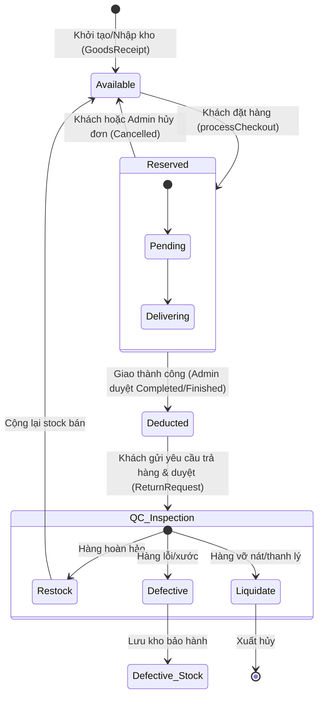
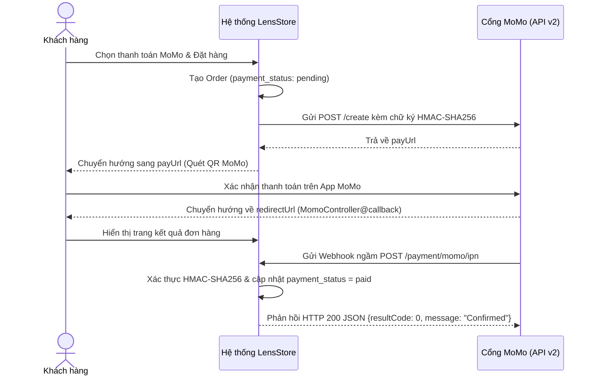

# 🔄 Domain Workflows & Business Logic Specification

> **Tài liệu đặc tả các luồng nghiệp vụ cốt lõi, cỗ máy trạng thái (State Machine) và logic chuỗi cung ứng trong LensStore.**

---

## 1. Cỗ Máy Quản Lý Tồn Kho (Inventory State Machine)

Hệ thống sử dụng cơ chế quản lý kho đa cấp (Multi-tier Stock) nhằm đảm bảo không bao giờ xảy ra hiện tượng **bán khống (overselling)** hoặc **lệch sổ kho**.

### 1.1. Ba Trụ Cột Tồn Kho Trên Mỗi Sản Phẩm (`Product`)
1. **`stock` (Tồn kho bán được)**: Số lượng ống kính thực tế đang nằm trên kệ và sẵn sàng phục vụ khách hàng đặt mua.
2. **`reserved_stock` (Tồn kho giữ chỗ)**: Số lượng ống kính đã có khách đặt hàng nhưng đơn hàng chưa giao thành công (đang trong các trạng thái `pending`, `preparing`, `picked_up`, `delivering`).
3. **`defective_stock` (Tồn kho hàng lỗi/chờ bảo hành)**: Số lượng ống kính lỗi/trầy xước trả về từ khách hàng đã qua kiểm định QC, chờ gửi trả hãng sản xuất hoặc thanh lý.

---

### 1.2. Sơ Đồ Biến Động Kho Qua Vòng Đời Đơn Hàng



### 1.3. Chi Tiết Thực Thi Code (Code Implementations)

#### A. Khi Khách Đặt Hàng (`OrderController@processCheckout`)
- Kiểm tra `product->stock >= cart->quantity`. Nếu không đủ, ném ra ngoại lệ ngay.
- Trừ `stock` và tăng `reserved_stock`:
  ```php
  $product->decrement('stock', $cart->quantity);
  $product->increment('reserved_stock', $cart->quantity);
  ```

#### B. Khi Đơn Hàng Giao Thành Công (`Admin\OrderController@updateStatus`)
- Khi trạng thái chuyển sang `completed` hoặc `finished`:
  1. Trừ `reserved_stock` của sản phẩm:
     ```php
     $product->decrement('reserved_stock', $item->quantity);
     ```
  2. **Tự động sinh Phiếu Xuất Kho (`GoodsIssue`)** loại `sale`:
     ```php
     $issue = GoodsIssue::create([
         'order_id' => $order->id,
         'user_id'  => auth()->id(),
         'type'     => 'sale',
         'status'   => 'completed',
         'note'     => 'Hệ thống tự động xuất kho do Đơn hàng #' . $order->id . ' giao thành công'
     ]);
     ```
  3. **Ghi nhận Sổ cái biến động kho (`InventoryTransaction`)** loại `out`.

#### C. Khi Đơn Hàng Bị Hủy (`OrderController@cancel` hoặc Admin)
- Hoàn trả số lượng từ `reserved_stock` về `stock`:
  ```php
  $product->decrement('reserved_stock', $item->quantity);
  $product->increment('stock', $item->quantity);
  ```
- Nếu đơn hàng đã có mã vận đơn GHN, gọi API hủy vận đơn sang GHN (`ghn->cancelOrder`).

#### D. Khi Nhập Kho Mới (`GoodsReceiptController`)
1. Nhân viên thủ kho lập phiếu nhập nháp (`status = 'draft'`). Lúc này `stock` chưa thay đổi.
2. Quản lý kiểm tra thực tế và bấm **"Hoàn tất nhập kho"** (`GoodsReceiptController@complete`):
   - Đổi `status` thành `'completed'`.
   - Duyệt từng mặt hàng: `$product->increment('stock', $detail->quantity)`.
   - Ghi nhận `InventoryTransaction` loại `in` với quan hệ polymorphic đến `GoodsReceipt`.

#### E. Kiểm Định Hàng Hoàn Về (`QcInspectionController@store`)
Khi khách hoàn hàng và kiện hàng về tới kho, kỹ thuật viên QC kiểm định và đưa ra quyết định (`final_action`):
- `restock` (Hàng còn nguyên seal/hoàn hảo):
  `$product->increment('stock', $quantity);` -> Đưa lại vào kho bán.
- `send_to_vendor` (Hàng lỗi quang học/lỗi kỹ thuật):
  `$product->increment('defective_stock', $quantity);` -> Lưu kho chờ gửi hãng bảo hành.
- `liquidate` (Hàng trầy xước/thanh lý):
  Tạo phiếu xuất kho thanh lý hoặc ghi nhận giao dịch xuất kho đặc biệt.

---

## 2. Vòng Đời & Trạng Thái Đơn Hàng (Order Lifecycle)

| Mã trạng thái | Tên hiển thị tiếng Việt | Màu sắc Badge | Ý nghĩa & Điều kiện chuyển tiếp |
|---|---|---|---|
| `pending` | Chờ xác nhận | `#f59e0b` (Vàng) | Đơn mới tạo, đang chờ shop xác nhận |
| `preparing` | Đang chuẩn bị hàng | `#3b82f6` (Xanh lam) | Shop đã in đơn, đóng gói ống kính |
| `picked_up` | ĐVVC đã lấy hàng | `#8b5cf6` (Tím nhạt) | Shipper GHN đã đến shop lấy hàng |
| `delivering` | Đang giao hàng | `#6366f1` (Indigo) | Bưu tá đang đi giao đến tay khách hàng |
| `completed` | Giao hàng thành công | `#10b981` (Xanh lá) | Khách đã nhận được hàng; tự động chuyển thanh toán = `paid` |
| `finished` | Đã hoàn thành | `#059669` (Xanh lục đậm)| Tự động chuyển sau 10 ngày từ `completed` (tại `DashboardController`) |
| `returning` | Đang yêu cầu trả hàng | `#ea580c` (Cam đỏ) | Khách tạo yêu cầu đổi/trả hàng |
| `returned` | Đã trả hàng / hoàn tiền | `#64748b` (Xám) | Hoàn tất trả hàng và xử lý tài chính |
| `cancelled` | Đã hủy | `#ef4444` (Đỏ) | Đơn bị hủy; hoàn trả lại `reserved_stock` về `stock` |

---

## 3. Quy Trình Thanh Toán MoMo (MoMo Payment Flow)



- **Thanh toán lại (`payAgain`)**: Nếu người dùng vô tình đóng trình duyệt khi đang quét mã MoMo, họ có thể vào lại trang **Chi tiết đơn hàng (`orders.show`)** và bấm nút **"Thanh toán lại bằng MoMo"** để tạo đường dẫn thanh toán mới mà không cần đặt lại đơn.

---

## 4. Quy Trình Hỗ Trợ Khách Hàng Qua Live Chat

- **Công nghệ**: Long-polling tối ưu qua AJAX (`GET /user/chat/messages?since_id=xxx`).
- **Phân loại tác nhân**:
  - Khách hàng (`customer`): Chat thông qua Floating Chat Widget ở góc phải màn hình (`partials/customer-chat.blade.php`).
  - Nhân viên tư vấn / Quản trị viên (`staff`, `admin`): Trả lời tại trang Chat Desk quản trị chuyên nghiệp (`/admin/chat`).
- **Tính năng đặc biệt**:
  - Đính kèm thẻ sản phẩm ống kính: Người dùng bấm "Nhờ tư vấn sản phẩm này" trên trang chi tiết ống kính, tin nhắn sẽ tự động gửi kèm liên kết và ảnh đại diện của ống kính đó.
  - Tải ảnh đính kèm (ảnh lỗi, ảnh mẫu): Upload trực tiếp vào tin nhắn.
  - Tự động đánh dấu đã đọc (`mark_read = true`) khi người dùng mở khung chat.

---

## 5. Quy Trình Phân Quyền Vai Trò (RBAC Architecture)

Hệ thống quản lý quyền thông qua cấu trúc phân nhóm nghiệp vụ được quản lý tập trung tại `App\Support\PermissionCatalog`:

```
PermissionCatalog
├── 1. Tổng quan (overview)
│   ├── view_dashboard      (Xem trang điều khiển)
│   └── view_reports        (Xem báo cáo & xuất CSV)
├── 2. Kinh doanh (commerce)
│   ├── manage_orders       (Quản lý đơn hàng)
│   ├── manage_products     (Thêm, sửa, xóa sản phẩm ống kính)
│   └── manage_categories   (Quản lý danh mục)
├── 3. Quản lý Kho hàng (inventory)
│   ├── manage_goods_receipts (Phiếu nhập kho)
│   ├── manage_goods_issues   (Phiếu xuất kho)
│   └── manage_qc_inspections (Kiểm định hàng hoàn QC)
├── 4. Khách hàng & Marketing (crm)
│   ├── manage_customers    (CRM & ghi chú tư vấn)
│   └── manage_vouchers     (Quản lý mã giảm giá)
├── 5. Nội dung (content)
│   ├── manage_news         (Toàn quyền tin tức)
│   ├── view_news / create_news / edit_news / delete_news
└── 6. Hệ thống (system - Quyền nhạy cảm)
    ├── manage_users        (Quản lý nhân sự)
    └── manage_roles        (Phân quyền chức vụ)
```

- **Nguyên tắc phân quyền**:
  - Admin tối cao (`role = 'admin'`): Có toàn bộ quyền hệ thống.
  - Nhân viên chức vụ (`role = 'staff'`): Được phân các quyền cụ thể thông qua vai trò Spatie Role.
  - Khách hàng (`role = 'customer'`): Chỉ có quyền trên tài nguyên cá nhân của chính mình.
